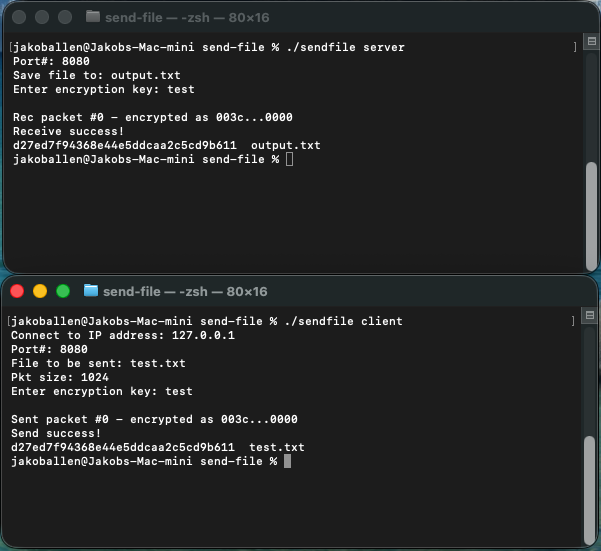

# 📡 send-file

A lightweight client/server file transfer system written in C++ using raw TCP sockets, with chunked streaming and a simple XOR-based encryption layer.



---

## ✨ Features

- Custom TCP client/server implementation (single binary mode)
- Chunked file transfer over sockets
- XOR-based encryption/decryption layer
- Configurable packet size
- File integrity check via system MD5
- Packet-level debug output (useful for learning/debugging)

---

## 📁 Project Structure

```
send-file/
│
├── include/
│   ├── network.h
│   ├── file_io.h
│   ├── crypto.h
│   └── util.h
│
├── src/
│   ├── main.cpp
│   ├── network.cpp
│   ├── file_io.cpp
│   ├── crypto.cpp
│   └── util.cpp
│
├── test.txt
├── Makefile
└── README.md
```

---

## ⚙️ Build Instructions

### Compile
```
make
```

### Clean build
```
make clean
```

This produces:
```
sendfile
```

---

## 🚀 Usage

### Start server
```
./sendfile server
```

You will be prompted for:
- Port number
- Output file name
- Encryption key

---

### Start client
```
./sendfile client
```

You will be prompted for:
- Server IP address
- Port number
- File to send
- Packet size (bytes)
- Encryption key

---

## 🔁 Example Workflow

### Terminal 1 (Server)
```
./sendfile server

Port#: 8080
Save file to: output.txt
Enter encryption key: test
```

### Terminal 2 (Client)
```
./sendfile client

Connect to IP address: 127.0.0.1
Port#: 8080
File to be sent: test.txt
Pkt size: 1024
Enter encryption key: test
```

---

## 🔐 Encryption

This project uses a simple XOR cipher:

- Same key is used for encryption and decryption
- Applied before sending and after receiving
- Intended for learning purposes, not security

---

## 🧠 How it works

1. Client reads file into memory
2. File is encrypted using XOR key
3. Data is sent in fixed-size packets over TCP
4. Server receives and reconstructs file
5. Server decrypts using same key
6. Output file is written to disk

---

## 🧪 Quick Test

You can test locally using the included sample file:

```
test.txt
```

### Steps

1. Start the server:
```
./sendfile server
```

2. In another terminal, run the client:
```
./sendfile client
```

3. Use:
- IP: `127.0.0.1`
- Same port on both
- Same encryption key on both
- File: `test.txt`

This will transfer the file locally and verify the full workflow.

---

## 🧪 Notes

- Server must be started before client
- Same port and encryption key must be used on both sides
- Designed for local network / learning purposes
- Not intended for production use

---

## 🛠️ Tech Stack

- C++
- POSIX sockets
- Linux system calls
- XOR cipher (custom implementation)
- Makefile build system

---

## 📌 Purpose

This project was built to explore:

- Low-level networking in C++
- File streaming over TCP
- Manual memory management
- Basic encryption techniques
- System-level programming concepts